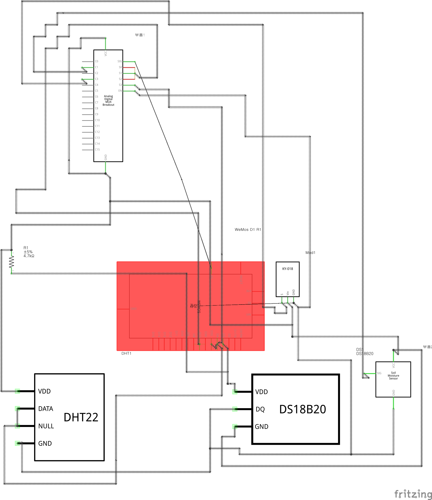
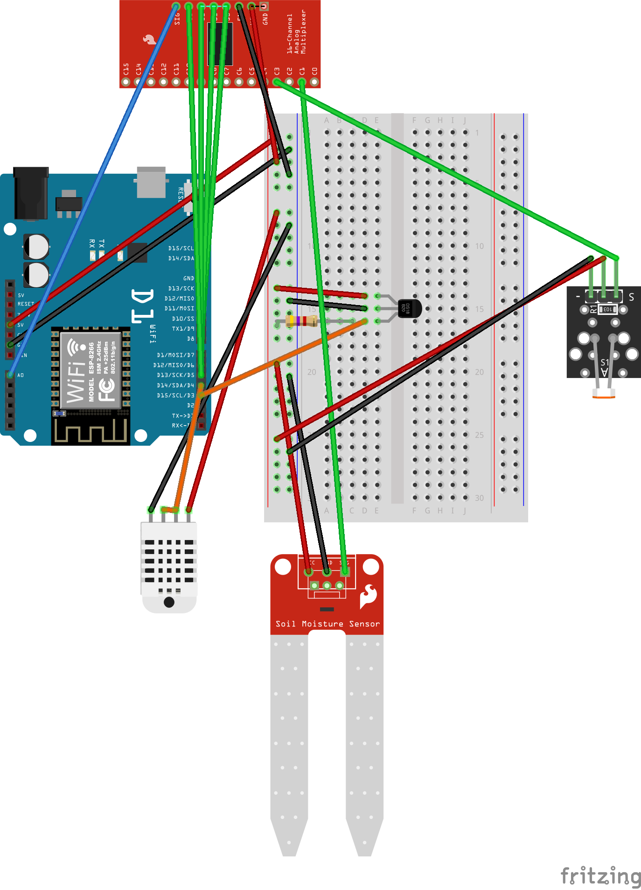
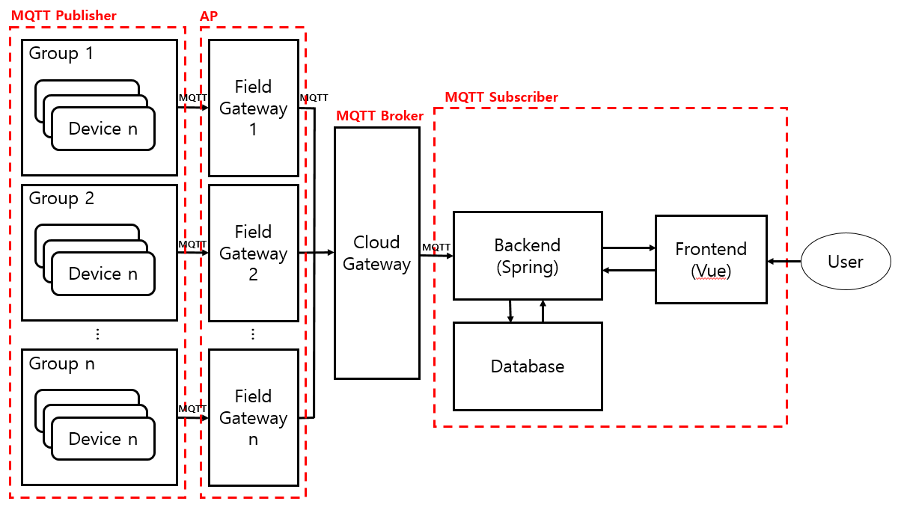
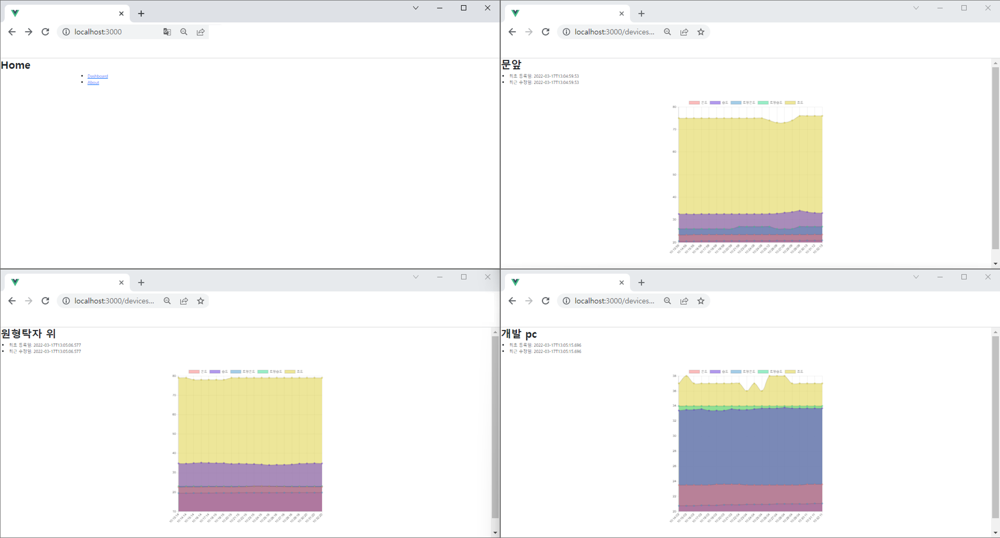

- [iot-jpa-vue](#iot-jpa-vue)
  - [Summary](#summary)

# iot-jpa-vue
## Summary
* This Project is Simple IoT Monitoring System Using Spring JPA & VUE.
* The Board used for the device is the Wemos D1 S1.
* the Sensors used and the Measured Data are shown in the Table below.

| Sensor       | Data                   | Type  |
| ------------ | ---------------------- | ----- |
| DHT-22       | Temperature & Humidity | float |
| DS18B20      | Soil Tempeature        | float |
| FC-28        | Soil Moisture          | float |
| SZH-SSBH-011 | Illumination           | float |

* FC-28(for Soil Moisture) and SZH-SSBH-011(for Illumination) accept analog signals,
* but the Wemos D1 S1 board has only one analog input pin.
* So I use a Multiplexer to extend the Analog pin.
* The Schematic for this is shown in the Figure below.(I'm not an Expert. But it works fine😅)
  

   
  Figure 1. Schematic 
   
   
  Figure 2. Sketch 
   

* The Generated Data is delivered to the Spring Server through MQTT.  
* Users can register devices and check the measured values through the webpage configured with Vue.
* The Architecture is shown below.

   
  Figure 3. Architecture 
   

* Finally, you will get the following Screen.

   
  Figure 4. Screenshot 
   

